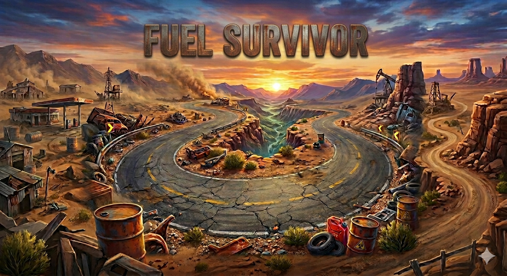

1. Identificação do Projeto

Título do Projeto: Fuel Survivor

Desenvolvedor: Pedro

Professor Orientador: Carlos

Disciplina: Programação Orientada a Objetos

2. Visão Geral do Sistema

📌 Descrição

O Fuel Survivor é um jogo digital desenvolvido com tecnologias web, utilizando HTML, Canvas API e JavaScript. O sistema consiste em um game 2D no qual o jogador controla um veículo com o objetivo de sobreviver o maior tempo possível, gerenciando seus recursos e evitando obstáculos.

🎯 Objetivo

O objetivo principal do jogo é conduzir um carro ao longo de diferentes cenários, coletando galões de combustível para manter sua sobrevivência, enquanto evita colisões com veículos inimigos. O jogador deve acumular pontos suficientes para avançar entre as fases e alcançar a vitória.

🌍 Tema

O jogo apresenta um tema de sobrevivência em ambiente rodoviário, no qual o combustível representa diretamente a vida do jogador. A progressão ocorre em três cenários distintos:

Fase 1: Deserto

Fase 2: Cidade

Fase 3: Cidade com neve

Cada fase apresenta aumento gradual na dificuldade, proporcionando maior desafio ao jogador.

🎮 Instruções de Jogabilidade
Controles:

W ou Seta para cima (↑): Movimentar o carro para cima

S ou Seta para baixo (↓): Movimentar o carro para baixo

Mecânicas:

O movimento do veículo é restrito ao eixo vertical (cima e baixo).

O jogador deve coletar galões de combustível para manter sua vida.

O combustível diminui com o tempo, funcionando como um sistema de vida.

Colisões com veículos inimigos resultam na perda de combustível.

A ausência de coleta de combustível leva à derrota do jogador.

⚙️ Especificações Técnicas

Progressão de Fases:

Ao atingir 30 pontos, o jogador avança para a Fase 2.

Ao atingir 60 pontos, o jogador avança para a Fase 3.

Ao atingir 90 pontos, o jogador vence o jogo.

Sistema de Vida:

A vida do jogador é representada pelo nível de combustível.

O combustível é reduzido gradualmente ao longo do tempo.

Colisões com inimigos aceleram a perda de vida.

Nível de Dificuldade:

A velocidade dos veículos inimigos aumenta a cada nova fase.

O aumento de dificuldade exige maior precisão e tempo de reação do jogador.

👨‍💻 Tecnologias Utilizadas

HTML

JavaScript

Canvas API

📖 Créditos

Este projeto foi desenvolvido por Pedro, como parte das atividades da disciplina de Programação Orientada a Objetos, sob orientação do professor Carlos.
